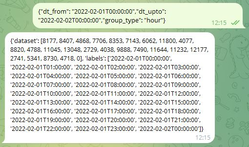
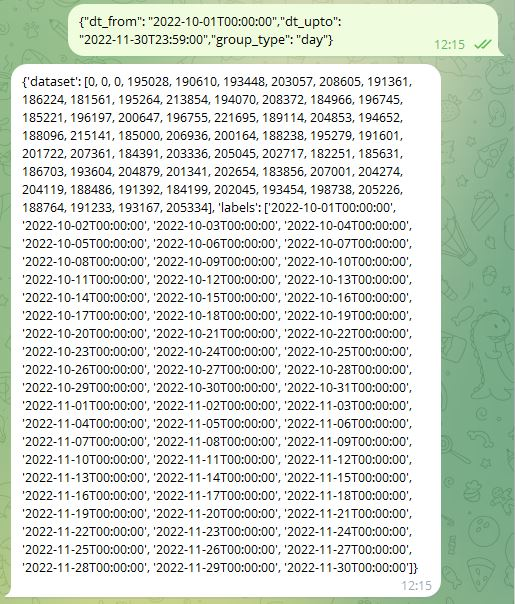
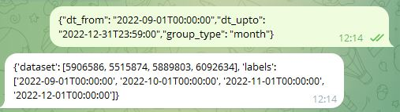

# Телеграм бот для выбортки данных из mongodb 

Агрегирует статистические данных о зарплатах сотрудников компании по временным промежуткам
Получает на вход запрос:

{
"dt_from":"2022-09-01T00:00:00",
"dt_upto":"2022-12-31T23:59:00",
"group_type":"month"
}

Валидирует, делает запрос к бд и возвращает ответ вида:

{
'dataset': [5906586, 5515874, 5889803, 6092634], 
'labels':   ['2022-09-01T00:00:00', '2022-10-01T00:00:00', 
            '2022-11-01T00:00:00', '2022-12-01T00:00:00']
}

Позволяем выбирать тип агрегации - часы (hour), дни (day) или месяцы (month)

## клонируем репозиторий 

    mkdir app

    cd cat app

    git clone https://github.com/se-andrey/rtl_tgbot

### запуск

Для запуска создайте файл .env и заполните его в соответствии с .env.example    

### пример 

